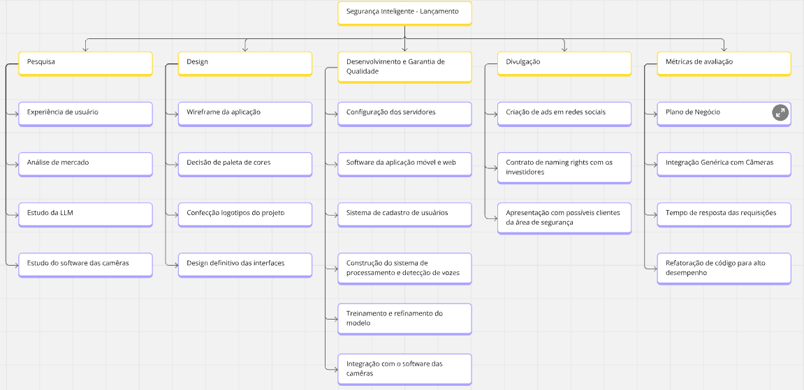
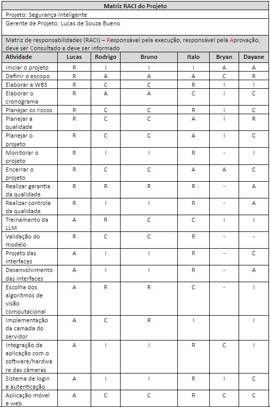
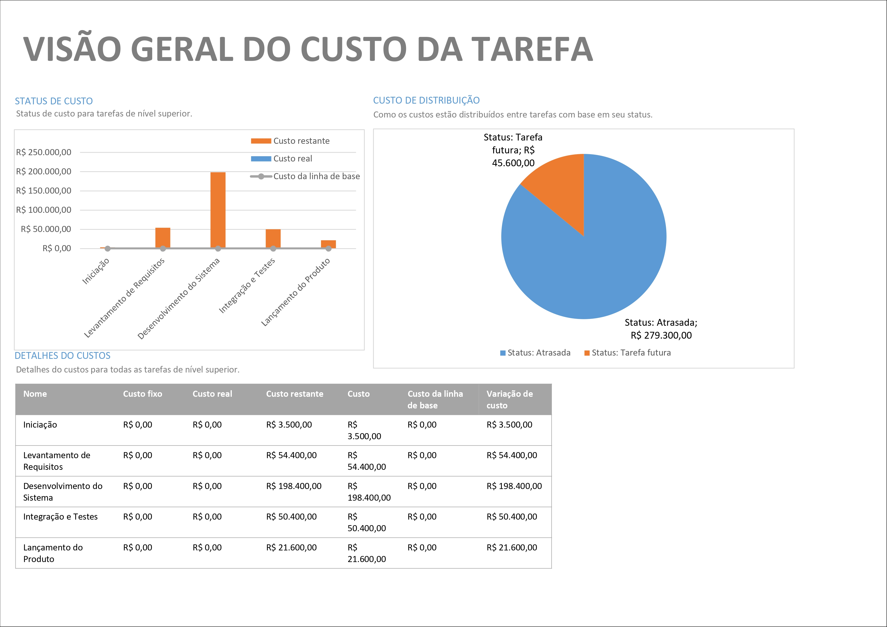
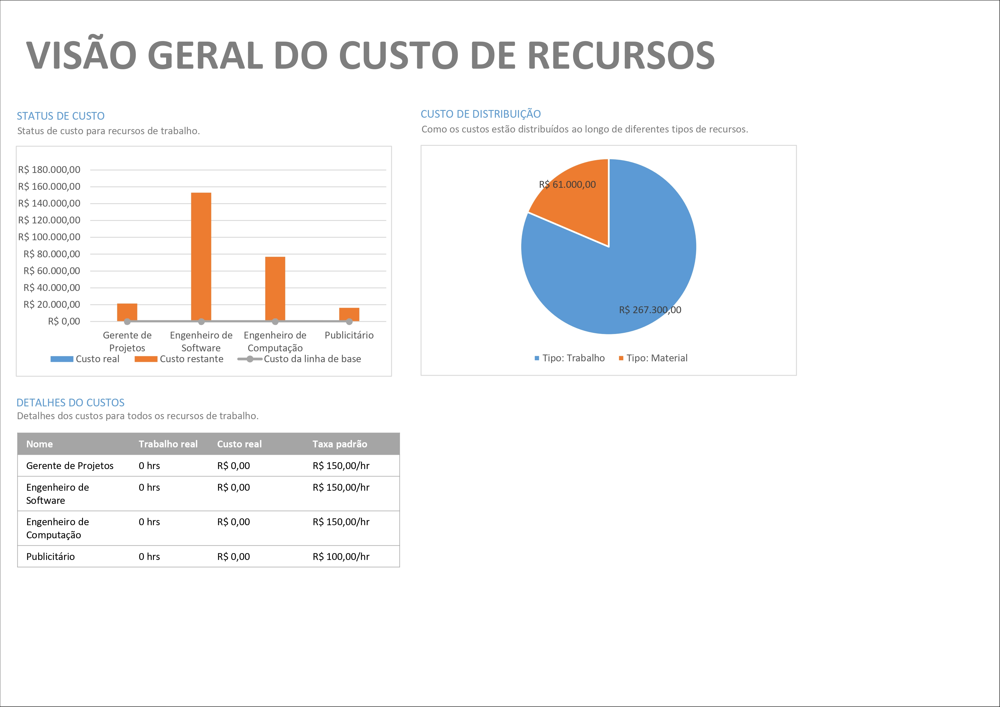

# Planejamento

> A fase de planejamento na gerência de projetos é um momento onde os detalhes do projeto são minuciosamente definidos para garantir uma execução bem-sucedida. 
> Durante essa etapa, os gerentes de projeto e suas equipes elaboram um plano abrangente que aborda aspectos como cronograma, orçamento, recursos necessários, riscos identificados e métodos de controle. 
> O objetivo é criar uma estrutura que guiará as atividades ao longo do projeto, garantindo que metas sejam alcançadas de maneira eficiente. 
> O plano de projeto não apenas define as tarefas específicas e suas interdependências, mas também estabelece critérios de sucesso e indicadores de desempenho. 
> A qualidade do planejamento influencia diretamente a capacidade da equipe em cumprir prazos, alocar recursos eficientemente e lidar com desafios que possam surgir durante a execução.

# Estrutura do Documento

- [Fase de Planejamento](#planejamento)
- [Escopo do Projeto](#escopo-do-projeto)
- [Estrutura Analítica do Projeto](#estrutura-analítica-do-projeto)
- [Matriz de Responsabilidades](#matriz-de-responsabilidades)
- [Cronograma do Projeto](#cronograma-do-projeto)
- [Orçamento do Projeto](#orçamento-do-projeto)
- [Planos de Gerenciamento](#planos-de-gerenciamento)
  - [Plano de Qualidade](#plano-de-qualidade)
  - [Plano de Aquisição](#plano-de-aquisição)
  - [Plano de Comunicação](#plano-de-comunicação)
  - [Plano de Riscos](#plano-de-riscos)

-----
```diff
+ Tarefa 04:
+ Escopo e Estrutura Analítica do Projeto
```

# Escopo do Projeto

### Projeto
Segurança Inteligente

### Gerente do Projeto
Lucas Bueno

### Objetivo do projeto 
Fornecer uma aplicação inteligente de auxílio à segurança residencial, por meio do uso de visão computacional e aprendizado de máquina.

### Escopo do projeto
* Definir requisitos funcionais e não funcionais, além de mapear necessidades dos usuários.
* Configuração das máquinas para treinamento da LLM e desenvolvimento do modelo adequado.
* Desenvolvimento de aplicação web e mobile para acesso ao monitoramento e configuração do sistema.
* Integração do sistema de monitoramento com os softwares terceiros das diversas marcas de câmeras de vigilância.
* Testar funcionalidade do software, integração com o serviço em cloud, e otimização do modelo para melhor desempenho.
* Comercialização do produto e disponibilidade de suporte a usuários.


### Restrições e Limites do projeto
* Comunicação contextual entre diferentes instâncias do sistema.
* Existência de diferentes modos de operação do aplicativo.
* Diferenciação entre modelos específicos de veículos.
* Implantação de um sistema interno contra falhas elétricas.
* Implantação de um sistema que contacte a polícia em caso de detecção de movimentos suspeitos.
  
### Premissas
* Assinatura de contrato de prestação de serviços.
* Apresentação de garantias definidas no contrato.
* Efetização do contrato da licença com a LLM.
* Configuração das máquinas para treinamento da LLM.
  
### Marcos Agendados e Entregas
|ID   | Marco do Projeto                                                  | 
|-----|-------------------------------------------------------------------|
|M-1  | Demonstração do funcionamento das funções principais do modelo |
|M-2  | Integração inicial do modelo em um sistema controlado de monitoramento |
|M-3  | Concepção do sistema funcional do projeto para avaliação dos clientes e investidores |
|M-4  | Aperfeiçoamento do modelo para situações do mundo real e adversas |
|M-5  | Integração definitiva para sistemas de segurança e monitoramento |
|M-6  | Interface visual e experiência do usuário com o sistema finalizado do projeto |
|M-7  | Garantia de implementação simplificada para o usuário final, como manuais e documentação |
|M-8  | Reuniões finais com os clientes e investidores para possíveis mudanças ou adições no sistema |
|M-9  | Mudanças de última hora com base no feedback, se necessário |
|M-10 | Lançamento oficial da aplicação |

# Estrutura Analítica do Projeto




### Documento Editável

- [Estrutura Analítica do Projeto - Editável](https://miro.com/welcomeonboard/d1hlbzBQMWE0ZUhVTzB4NDZNbXZVdHNoYTBqWjZ4eWRwaW9LS1BKWjdJMUFubklrRmRQMmdBdjRqcmZsblprb3wzNDU4NzY0NTk5OTk4NDMwNzE1fDI=?share_link_id=620927895530)

```diff
+ Tarefa 04:
+ Fim da seção a ser atualizada.
```

-----
```diff
+ Tarefa 05:
+ Matriz de Responsabilidades (RACI)
```

# Matriz de Responsabilidades

A matriz de responsabilidades foi construída pela gerência do projeto, com o apoio da equipe de desenvolvimento, com a finalidade de tornar transparente e melhor gerenciável a execução dos processos ao longo do projeto. Assim, todos os envolvidos terão conhecimento dos seus papéis e saberão direcionar as tarefas aos profissionais corretos.




### Documento Editável

- [Matriz de Responsabilidades (RACI) - Editável](artefatos/Matriz-RACI.docx)

```diff
+ Tarefa 05:
+ Fim da seção a ser atualizada.
```

-----
```diff
+ Tarefa 07:
+ Cronograma do Projeto
```

# Cronograma do Projeto

### Documento Editável

> Você deve atualiza o seguinte link (ou link correspondente), como o arquivo editável do Cronograma do Projeto:
- [Cronograma e Orçamento do Projeto - Editável](artefatos/Projeto3.mpp)

```diff
+ Tarefa 07:
+ Fim da seção a ser atualizada.
```

-----
```diff
+ Tarefa 08:
+ Orçamento do Projeto
```

# Orçamento do Projeto




```diff
+ Tarefa 08:
+ Fim da seção a ser atualizada.
```

# Planos de Gerenciamento

> Os planos de gerenciamento do projetos consolidam as diretrizes e estratégias para a execução bem-sucedida de um empreendimento. 
> Ele abrange diversos aspectos, como escopo, cronograma, custos, riscos, qualidade, recursos humanos, comunicação e aquisições, proporcionando uma visão abrangente e integrada do projeto. 
> Este plano funciona como um guia mestre que orienta a equipe de projeto e as partes interessadas ao longo do ciclo de vida do projeto, estabelecendo expectativas, responsabilidades e processos. 
> Além disso, serve como um instrumento de comunicação, alinhando as expectativas entre os membros da equipe e as partes interessadas, mitigando riscos e fornecendo uma estrutura sólida para a tomada de decisões. 

```diff
+ Tarefa 09:
+ Checklist de Qualidade
```

## Plano de Qualidade

As metodologias de qualidade foram definidas para garantir uma verificação eficaz e atender às expectativas dos stakeholders. **Testes automatizados** foram usados para validar precisão, desempenho e integração do modelo, permitindo ajustes rápidos em ambientes controlados. Já os **testes manuais** focaram na avaliação da usabilidade, clareza da documentação e interface visual, assegurando um sistema final intuitivo. Além disso, **inspeções de código** garantiram a conformidade com padrões de desenvolvimento, reduzindo riscos de falhas. Essa combinação de métodos automatizados e manuais unificou eficiência técnica e sensibilidade humana, promovendo um controle de qualidade mais completo e confiável.


### Artefatos a serem verificados

| Artefato                               | Tipo Verif. | Data        | Responsável    | Métrica              | Data Correção | Ação Não Conform.                   | Resp. Avaliação | Resp. Correção |
|----------------------------------------|-------------|-------------|----------------|----------------------|---------------|-------------------------------------|-----------------|----------------|
| Protótipo funcional do modelo          | Manual      | 2024-08-15  | Equipe técnica | Precisão ≥ 90%       | 2024-08-20    | Revisar e ajustar parâmetros        | QA Líder        | Equipe técnica |
| Integração inicial em ambiente controlado | Automático  | 2024-09-01  | DevOps         | Tempo de resposta ≤ 2s | 2024-09-05    | Refinar integração                 | DevOps          | Equipe técnica |
| Documentação para avaliação de clientes | Manual      | 2024-09-20  | Documentação   | Clareza e completude  | 2024-09-25    | Reescrever partes ambíguas          | QA Líder        | Documentação   |
| Testes para cenários adversos          | Automático  | 2024-10-10  | Equipe técnica | Precisão ≥ 85%       | 2024-10-15    | Ajustar treinamento do modelo       | QA Líder        | Equipe técnica |
| Sistema final de monitoramento         | Manual      | 2024-11-05  | Equipe técnica | Conformidade total    | 2024-11-10    | Resolver inconsistências detectadas | QA Líder        | Equipe técnica |
| Interface visual final                 | Manual      | 2024-11-25  | UI/UX Designer | Intuitividade ≥ 90%  | 2024-11-30    | Ajustar interface com feedback      | QA Líder        | UI/UX Designer |
| Manuais e documentação final           | Manual      | 2024-12-10  | Documentação   | Clareza e completude  | 2024-12-15    | Revisar informações                 | QA Líder        | Documentação   |

---

### Padrões e Normas Utilizadas

| Nome               | Descrição                                                                 |
|--------------------|---------------------------------------------------------------------------|
| ISO/IEC 25010      | Padrão para qualidade de software, incluindo características de usabilidade e confiabilidade. |
| IEEE 829           | Norma para documentação de teste de software.                           |
| ISO/IEC 27001      | Normas de segurança da informação aplicáveis ao sistema de monitoramento. |
| WAI-ARIA           | Diretrizes para acessibilidade da interface visual.                      |

---

### Ambiente das Atividades de Qualidade

| Ambiente       | Descrição                                                                 |
|----------------|---------------------------------------------------------------------------|
| Laboratório 1  | Equipado com câmeras de alta definição para teste do modelo em ambiente controlado. |
| Servidor QA    | Infraestrutura em nuvem para simulação e teste de integração do modelo.  |
| Sala de reunião| Ambiente para testes de usabilidade e apresentações para stakeholders.   |

---

### Equipe de Qualidade

| Nome                | Responsabilidade                          | 
|---------------------|------------------------------------------|
| Italo Henrique Soares dos Santos   | QA Líder                                |
| Luiza Isabel Gomes | UI/UX Tester (contratada)                           |
| Rodrigo Reis do Valle      | Teste de integração e desempenho         |
| Lucas de Souza Bueno          | Validação documental e padrões           |

---

### Metodologias de Qualidade Utilizadas

| Nome               | Descrição                                                                 |
|--------------------|---------------------------------------------------------------------------|
| Testes automatizados | Scripts que verificam precisão, desempenho e integração do modelo.     |
| Testes manuais       | Validação de interfaces e documentação com base no feedback dos stakeholders. |
| Inspeção de código   | Revisão de padrões de codificação e boas práticas antes do deploy.      |


```diff
+ Tarefa 09:
+ Fim da seção a ser atualizada.
```

```diff
+ Tarefa 10:
+ Especificação de Produto para Aquisição
```

## Plano de Aquisição

> O Plano de Aquisições define o processo relacionado à aquisição de bens e serviços necessários para a execução do projeto. 
> Este plano abrange a identificação de necessidades, a seleção de fornecedores, a elaboração de contratos, e a gestão do relacionamento com os fornecedores durante do ciclo de vida do projeto. 
> O Plano de Aquisições visa garantir a aquisição eficiente e eficaz dos recursos necessários, minimizando riscos e custos. 
> Além disso, ele proporciona transparência nas relações com fornecedores, promovendo a conformidade com os prazos estabelecidos e padrões de qualidade. 

### Documento Editável

> Você deve atualiza o seguinte link (ou link correspondente), como o arquivo editável de geração da WBS:
- [Especificação Produto Aquisição - Editável](artefatos/aquisicao_produtos.docx)


```diff
+ Tarefa 10:
+ Fim da seção a ser atualizada.
```

```diff
+ Tarefa 11:
+ Plano de Comunicação
```

## Plano de Comunicação

O plano de comunicação do projeto garante a troca eficiente de informações entre a equipe e os stakeholders, promovendo clareza, objetividade e transparência. Focado na colaboração e no alinhamento, ele estabelece diretrizes para manter todos informados e engajados ao longo do desenvolvimento.

> O Plano de Comunicação estabelece estratégias e diretrizes para facilitar a troca de informações entre os membros da equipe e as partes interessadas. 
> Este plano abrange aspectos como os meios de comunicação, a frequência das atualizações, os canais de distribuição de informações e os responsáveis pela comunicação. 
> Uma comunicação eficiente não apenas previne mal-entendidos e conflitos, mas também fortalece o engajamento da equipe e o apoio das partes interessadas. 
>
> Você pode utilizar como referência o seguinte documento:
- [Plano de Gerenciamento de Comunicação - Editável](artefatos/plano_comunicacao.docx)

### Plano de Comunicação do Projeto

| Entregável                         | Público-Alvo                  | Método de Comunicação             | Frequência         | Responsável       |  
|------------------------------------|-------------------------------|-----------------------------------|--------------------|-------------------|  
| Ata de reunião                     | Equipe e stakeholders         | Reunião virtual no **Microsoft Teams** | Após cada reunião  | Gerente de Projetos |  
| Declaração de escopo               | Equipe de desenvolvimento         | Arquivo *Markdown* no repositório do **GitHub** | Atualização inicial e após alterações significativas | Gerente de Projetos |  
| WBS                                | Equipe de desenvolvimento     | Documento criado pelo **Microsoft Project** | Semanal            | Líder Técnico      |  
| Dicionário da WBS                  | Equipe de desenvolvimento     | Documento criado pelo **Microsoft Project** | Atualização contínua | Líder Técnico      |  
| Cronograma                         | Equipe e stakeholders         | Gráfico de Gantt criado pelo **Microsoft Project** | Quinzenal          | Gerente de Projetos |  
| Lista de Riscos                    | Equipe e stakeholders         | Planilha no **Microsoft Excel** | Mensal             | Engenheiro de Software Líder |  
| Plano de qualidade                 | Equipe de QA | Arquivo *Markdown* no repositório do **GitHub** | Após revisões importantes | Líder técnico |  
| Plano de projeto                   | Stakeholders e equipe         | Documento PDF concebido em **Microsoft Word** | Após alterações relevantes | Gerente de Projetos |  
| Relatório de Progresso             | Stakeholders                  | Relatório via **Microsoft Word**, apresentação no **Microsoft Teams** | Quinzenal          | Gerente de Projetos |  
| Relatório de Aderência ao Processo | Equipe de desenvolvimento     | Planilha criada em **Microsoft Excel** | Semanal            | Líder Técnico |  
| Checklists de Inspeção             | Equipe de QA e gerente                  | Planilhas criadas no **Microsoft Excel** | Após cada inspeção | Equipe de QA      |  
| Feedback dos Stakeholders          | Stakeholders e gerente        | E-Mails pelo **Gmail** ou Reunião via **Microsoft Teams** | Mensal             | Gerente de Projetos |  
| Relatórios de Testes               | Equipes de QA e desenvolvimento| Relatórios PDF em **Microsoft Word** e Apuração de testes automatizados via **GitHub** | Após cada sprint   | Equipe de QA       |  
| Atualizações do Produto            | Stakeholders                  | Vídeos demonstração enviados por **Gmail** ou Reuniões no **Microsoft Teams** | Mensal             | Líder Técnico      |  

> Legenda:
> - Público: a quem se destina a comunicação.
> - Método de Comunicação: e_mail, reunião presencial, reunião virtual, etc.
> - Freqüência: diária, semanal, quinzenal, mensal, etc.
> - Responsável: pessoa responsável pela comunicação.

### Plano de Gerência de Comunicação

#### Ferramentas Utilizadas:

- [Microsoft Teams](https://www.microsoft.com/pt-br/microsoft-teams)
- [GitHub](https://github.com/)  
- [Microsoft Project](https://www.microsoft.com/pt-br/microsoft-365/project/project-management-software)
- [Microsoft Excel](https://www.microsoft.com/pt-br/microsoft-365/excel)
- [Microsoft Word](https://www.microsoft.com/pt-br/microsoft-365/word)
- [Gmail](https://www.google.com/intl/pt-BR/gmail/about/)

---

#### Papéis:

- **Gerente de Projetos**: Responsável por organizar reuniões, atualizar cronogramas e gerar relatórios para stakeholders.  
- **Líder Técnico**: Coordena a WBS, seu dicionário e o plano de qualidade; supervisiona atualizações do produto.  
- **Equipe de QA**: Elabora e mantém checklists de inspeção, relatórios de testes e garante o alinhamento com o plano de qualidade.  
- **Engenheiro de Software Líder**: Administra a lista de riscos, coordena inspeções e colabora na produção de relatórios técnicos.  
- **Stakeholders**: Recebem relatórios de progresso, feedbacks e atualizações do produto para alinhamento estratégico.  

---

#### Princípios Gerais:

1. **Clareza**: Todas as mensagens e relatórios devem ser escritos de forma simples e direta, evitando jargões desnecessários.  
2. **Objetividade**: Foco na comunicação de informações relevantes e alinhadas aos objetivos do projeto.  
3. **Imparcialidade**: Informações devem ser transmitidas sem favorecimento de interesses específicos, priorizando a verdade factual.  
4. **Impessoalidade**: O conteúdo deve ser centrado no projeto e nos resultados, sem conotações pessoais ou subjetivas.  
5. **Cordialidade**: A interação entre os envolvidos deve respeitar normas de etiqueta e manter um ambiente colaborativo e respeitoso.  

---

#### Plano de Gerência de Configuração:  
O controle de versões será feito no **GitHub**, em repositórios privados. As alterações serão revisadas antes de serem integradas ao ramo principal, com as seguintes responsabilidades:  
- **Gerente de Projetos**: Aprova mudanças no escopo e na documentação.  
- **Líder Técnico**: Revisa e aprova ajustes técnicos no código e na WBS.  
- **Equipe de QA**: Garante que as versões seguem os critérios de qualidade.  

Essa estrutura assegura rastreamento, controle de mudanças e alinhamento entre todos os envolvidos.

```diff
+ Tarefa 11:
+ Fim da seção a ser atualizada.
```

```diff
+ Tarefa 12:
+ Riscos do Projeto
```

## Plano de Riscos

......  COLOQUE AQUI O SEU TEXTO ......


> O plano de riscos busca antecipar, avaliar e mitigar os desafios potenciais que podem surgir ao longo do projeto. 
> Este documento estratégico oferece uma visão global dos riscos, categorizando-os e delineando estratégias para lidar com cada uma das possíveis adversidades. 
> Inicialmente, é realizada a identificação detalhada dos riscos, abrangendo desde ameaças imprevistas até oportunidades que podem ser exploradas. 
> Uma vez catalogados, os riscos são avaliados quanto à sua probabilidade de ocorrência e impacto, permitindo a priorização e foco em áreas críticas.
>
> O plano de riscos não apenas destaca os perigos em potencial, mas também estabelece respostas e estratégias de contingência. 
> Isso inclui a definição de ações preventivas para mitigar riscos antes que se materializem, bem como estratégias de mitigação para minimizar seu impacto se ocorrerem. 
> Além disso, a identificação de pontos de monitoramento contínuo ao longo do projeto permite uma resposta ágil às mudanças nas condições do ambiente.
>
> Você pode utilizar como referência o seguinte documento:
- [Plano de Gerenciamento de Riscos - Editável](artefatos/plano_riscos.xls)

| Categoria do Risco  | Descrição do Risco | Impacto       | Risco         | Medidas de Prevenção (Contramedidas) | Medidas de Contingência (Mitigação) | 
|---------------------|--------------------|---------------|---------------|--------------------------------------|-------------------------------------|
|                     |                    |               |               |                                      |                                     |
|                     |                    |               |               |                                      |                                     |
|                     |                    |               |               |                                      |                                     |
|                     |                    |               |               |                                      |                                     |
|                     |                    |               |               |                                      |                                     |
|                     |                    |               |               |                                      |                                     |
|                     |                    |               |               |                                      |                                     |
|                     |                    |               |               |                                      |                                     |
|                     |                    |               |               |                                      |                                     |
|                     |                    |               |               |                                      |                                     |

> Indique:
> Categoria do Risco: *ex.: Cliente, Cronograma, Orçamento, Aquisição de produtos, etc*
> Descrição do Risco: *ex.: Cliente não aparenta ter muito interesse no projeto*
> Impacto: *Baixo / Médio / Alto*
> Risco: *Baixo / Médio / Alto*
> Medidas de Prevenção: *Medidas que devem ser adotadas para evitar que o risco se concretize*
> Medidas de Contingência: *Medidas que devem ser adotadas caso o risco se concretize*
>
> *Obs.: Para determinar o risco considere a seguinte combinação entre Probabilidade e Impacto:

| Probabilidade | Impacto       | Risco         |
|---------------|---------------|---------------|
| Baixo         | Baixo         | Baixo         |
| Médio         | Médio         | Médio         |
| Alto          | Alto          | Alto          |
| Baixo         | Médio         | Médio         |
| Médio         | Baixo         | Médio         |
| Baixo         | Alto          | Médio         |
| Alto          | Baixo         | Médio         |
| Médio         | Alto          | Alto          |
| Alto          | Médio         | Alto          |


```diff
+ Tarefa 12:
+ Fim da seção a ser atualizada.
```

-----


